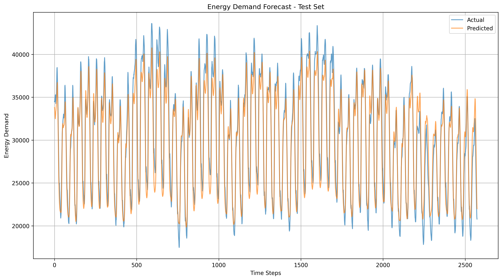
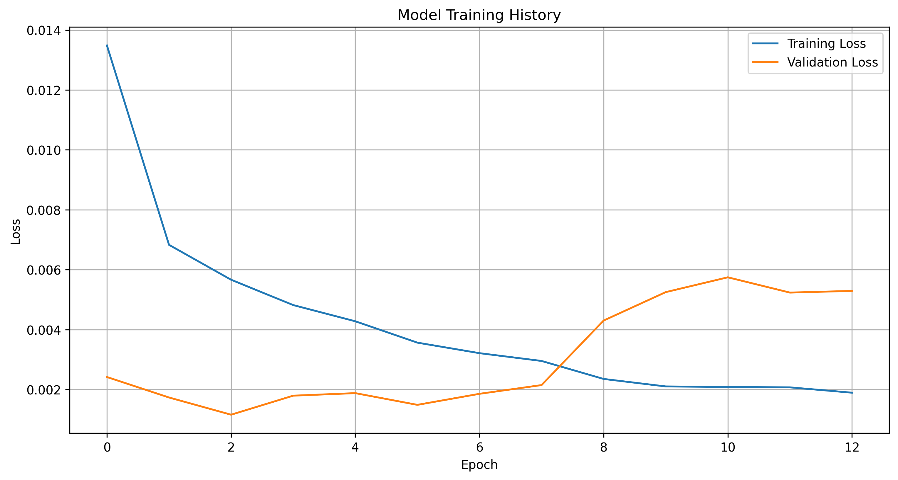
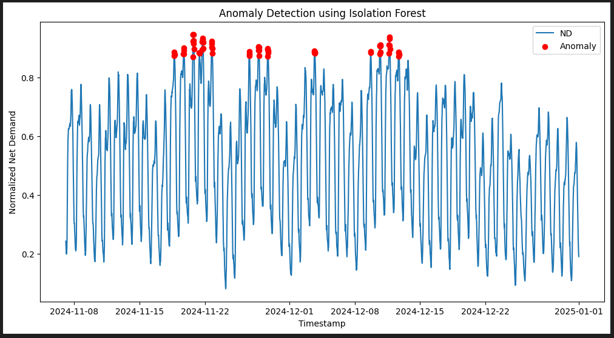
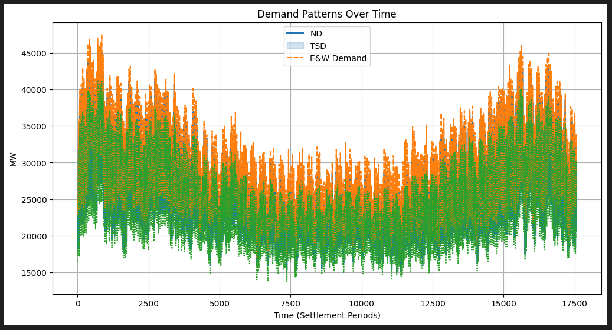
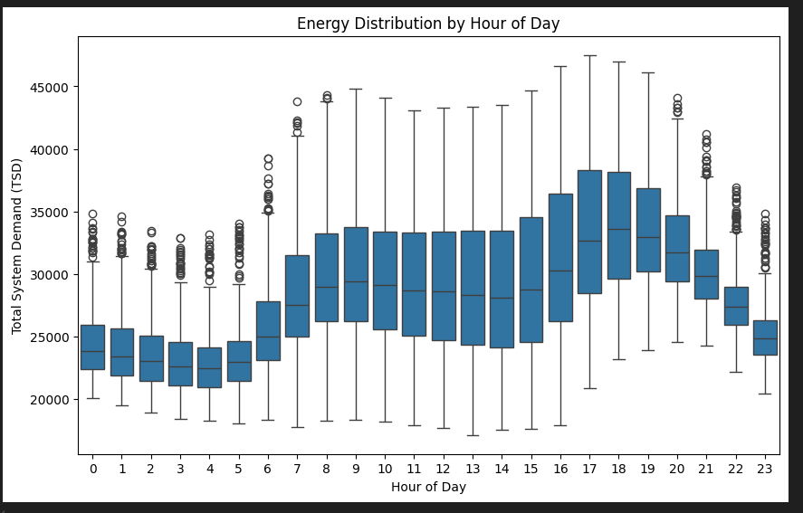

# UK Electricity Demand Forecasting and Anomaly Detection

Final Year Project — B.Sc. (Hons) Computer Science, London South Bank University (2024-2025)

---

## What this project is about

[WRITE THIS IN YOUR OWN WORDS — why did you choose this topic, what problem does it solve, why does electricity demand forecasting matter]

---

## Dataset

- Source: National Grid demanddata_2024 (publicly available half-hourly settlement data)
- 17,568 records across 22 features
- Time range: January 2024 to December 2024
- Key columns used: ENGLAND_WALES_DEMAND, Net Demand (ND), Total System Demand (TSD)

---

## What I built

[WRITE THIS IN YOUR OWN WORDS — describe the pipeline you built, what steps you went through, what decisions you made]

---

## Models compared

| Model | Notes |
|-------|-------|
| Ridge Regression | Baseline linear model |
| Lasso Regression | Linear model with feature selection |
| Random Forest | 100 trees, non-linear patterns |
| LSTM (best model) | Two-layer LSTM, 50 units each, 20% dropout |

[ADD YOUR ACTUAL MAE AND RMSE NUMBERS HERE when you run main.py]

---

## Results











---

## Tech stack

- Python, Pandas, NumPy
- scikit-learn (Ridge, Lasso, Random Forest)
- TensorFlow/Keras (LSTM)
- Matplotlib, Seaborn
- Streamlit (interactive dashboard)
- AWS EC2 and S3 (training and deployment)

---

## How to run it

```bash
# Install dependencies
pip install -r requirements.txt

# Run the ML pipeline
python src/main.py

# Run the Streamlit dashboard
streamlit run app.py
```

Note: You need to download demanddata_2024.csv from National Grid's public data portal and place it in the root folder before running.

---

## What I learned

[WRITE THIS IN YOUR OWN WORDS — what surprised you, what was harder than expected, what would you do differently]

---

## Author

Syed Muhammad Hassan — B.Sc. (Hons) Computer Science, First Class, London South Bank University
